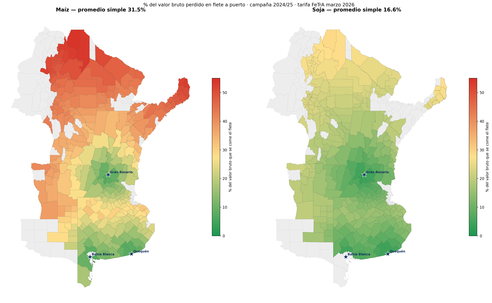

# El costo de la distancia

**Cuánto del valor de la cosecha se lo lleva el flete a puerto.**
Maíz y soja por departamento — campaña 2024/25 — tarifa FeTrA Nacional marzo 2026.

## Qué es esto

Para cada uno de los 311 departamentos productores de Argentina, se calcula qué
porcentaje del valor bruto de la cosecha (maíz y soja) se pierde en el flete
camionero hasta el puerto de exportación más cercano por ruta.

**Hallazgo central:** ese porcentaje va del **3,7 % al 54,3 %** según el
departamento. El maíz sufre casi el doble que la soja (31,5 % vs 16,6 % de
promedio simple), porque a igual flete por tonelada, su menor precio hace
que el mismo camión se coma una porción mayor del valor.

## Contenido del repo

| Carpeta | Contenido |
|---|---|
| `notebook/` | Pipeline completo y reproducible en Google Colab (Python) |
| `data/` | Insumos de producción y tarifa, y el `resultados.csv` final (583 filas: 311 deptos × 2 cultivos) |
| `outputs/` | Mapa estático (PNG), ranking por provincia (PNG) y mapa interactivo (HTML, Folium) |
| `informe/` | Informe ejecutivo en Word con el mapa, la lectura de resultados y la metodología completa |

## Metodología (resumen)

1. **Producción**: estimaciones agrícolas oficiales, campaña 2024/25.
2. **Distancia**: ruteo carretero real (OSRM) desde el centroide de cada
   departamento hasta el puerto de embarque más cercano por ruta —Gran
   Rosario, Bahía Blanca o Quequén—, con las tres terminales geolocalizadas
   sobre su punto real de carga.
3. **Costo del flete**: tarifa FeTrA Nacional de marzo 2026, interpolada por
   kilómetro. Es una tarifa de referencia sectorial, no un precio de mercado
   observado.
4. **Precios**: pizarra de cada puerto convertida a dólares (BCRA A3500,
   31/03/2026). El indicador central —el % del flete sobre el valor bruto—
   no depende del tipo de cambio en la gran mayoría de los casos, porque el
   factor se cancela en el cociente.

El detalle completo, los caveats (pizarra de soja, centroide vs. punto real
de acopio, sensibilidad de los montos en dólares) y las tablas de casos
extremos están en `informe/informe_costo_distancia.docx`.

## Cómo reproducirlo

El notebook corre de punta a punta en Google Colab:

1. Subir a la sesión de Colab: `data/estimaciones_limpio.csv`,
   `data/fetra_nacional_marzo_2026.csv`, y el shapefile de departamentos del
   IGN (`departamentos_ign.zip`, no incluido por peso — se descarga del
   [IGN](https://www.ign.gob.ar/NuestrasActividades/InformacionGeoespacial/CapasSIG)).
2. Ejecutar todas las celdas en orden (*Entorno de ejecución → Reiniciar y
   ejecutar todo*). La Fase 2 requiere salida a internet (usa el router
   público de OSRM).
3. El notebook regenera `distancias.csv`, `resultados.csv`, el mapa estático
   y el mapa interactivo.

## Mapa interactivo

`outputs/mapa_interactivo.html` se puede abrir directamente en el navegador,//
o publicarse con GitHub Pages para verlo online sin descargar nada.

## Fuentes

Estimaciones agrícolas oficiales · FeTrA Nacional (Disposición 273/11) ·
BCRA (tipo de cambio A3500) · IGN (cartografía de departamentos) · OSRM
(ruteo).

---
Elaboración propia · Mariano Romero
